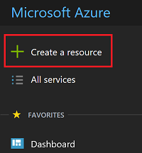
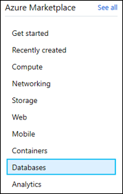
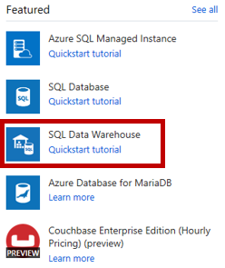
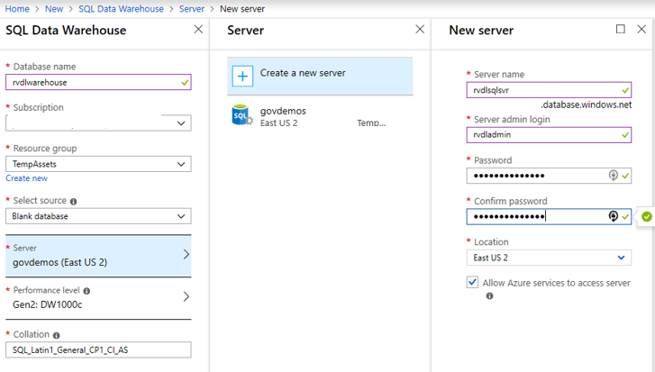
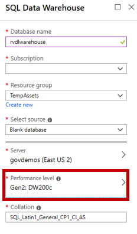
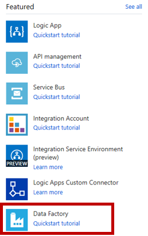
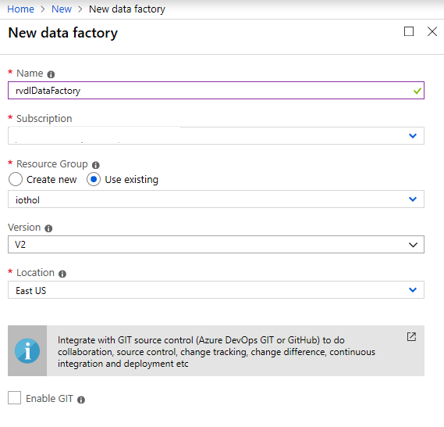

# Batch Analytics

## Batch Analytics with SQL Data Warehouse and Data Factory

SQL Data Warehouse is a cloud-based Enterprise Data Warehouse (EDW) that leverages Massively Parallel Processing (MPP) to quickly run complex queries across petabytes of data. Use SQL Data Warehouse as a key component of a big data solution. Import big data into SQL Data Warehouse with simple PolyBase T-SQL queries, and then use the power of MPP to run high-performance analytics. As you integrate and analyze, the data warehouse will become the single version of truth your business can count on for insights.

Azure Data Factory is a cloud-based data integration service that allows you to create data-driven workflows in the cloud for orchestrating and automating data movement and data transformation. Using Azure Data Factory, you can create and schedule data-driven workflows (called pipelines) that can ingest data from disparate data stores. It can process and transform the data by using compute services such as Azure HDInsight Hadoop, Spark, Azure Data Lake Analytics, and Azure Machine Learning.

In this lab Learn how to 

* automatically export data coming into Azure IoT Hub for archival.
* how to create an ingestion pipeline using Azure Data Factory, and
* how to use Data Warehouse to run big data analysis jobs that scale to massive data sets using familar tools.

## Create Azure SQL Data Warehouse Service

Create Data Lake Analytics service to mine data stored in Data Lake Store.

Click on **Create a resource**

Click on **Databases**

Click on **SQL Data Warehouse**

Create a new logical SQL Server which will act as the front end for your data warehouse

Since our intention is to showcase capabilities rather than performance, choose DW200c as the Performance Level

Use existing resource group and click on Create button

## Create Azure Data Factory Service

Create Data Factory service to ingest data into Data Warehouse.

Click on **Create a resource**

Click on **Integration**, then...

Simply name the Data Factory resource, use existing resource group and click on Create button

