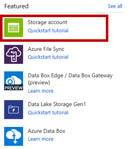
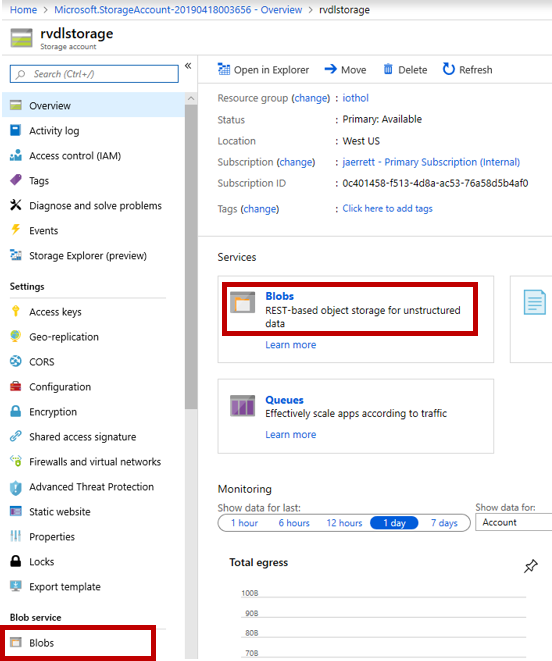
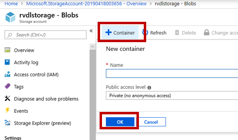
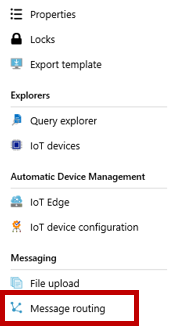
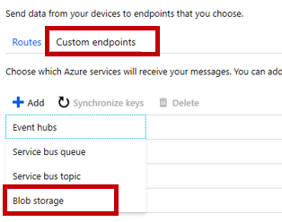
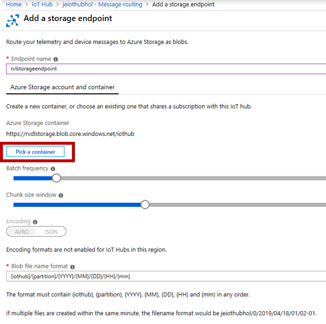
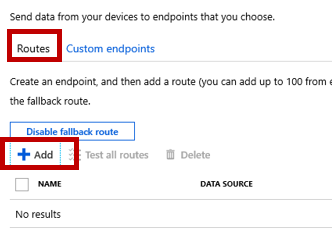
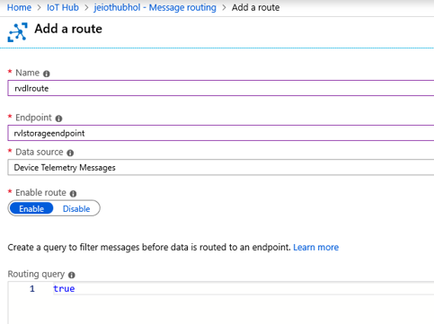
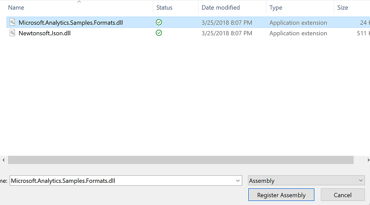

# Batch Analytics

## Batch Analytics with SQL Data Warehouse and Data Factory

SQL Data Warehouse is a cloud-based Enterprise Data Warehouse (EDW) that leverages Massively Parallel Processing (MPP) to quickly run complex queries across petabytes of data. Use SQL Data Warehouse as a key component of a big data solution. Import big data into SQL Data Warehouse with simple PolyBase T-SQL queries, and then use the power of MPP to run high-performance analytics. As you integrate and analyze, the data warehouse will become the single version of truth your business can count on for insights.

Azure Data Factory is a cloud-based data integration service that allows you to create data-driven workflows in the cloud for orchestrating and automating data movement and data transformation. Using Azure Data Factory, you can create and schedule data-driven workflows (called pipelines) that can ingest data from disparate data stores. It can process and transform the data by using compute services such as Azure HDInsight Hadoop, Spark, Azure Data Lake Analytics, and Azure Machine Learning.

In this lab Learn how to 

* automatically export data coming into Azure IoT Hub for archival.
* how to create an ingestion pipeline using Azure Data Factory, and
* how to use Data Warehouse to run big data analysis jobs that scale to massive data sets using familar tools.

## Create Azure SQL Data Warehouse Service

Create Data Lake Analytics service to mine data stored in Data Lake Store.

Click on **Create a resource**


Click on **Databases**


Click on **SQL Data Warehouse**


Create a new logical SQL Server which will act as the front end for your data warehouse


Since our intention is to showcase capabilities rather than performance, choose DW200c as the Performance Level


Use existing resource group and click on Create button

## Create Azure Data Factory Service

Create Data Factory service to ingest data into Data Warehouse.

Click on **Create a resource**


Click on **Integration**, then...


Simply name the Data Factory resource, use existing resource group and click on Create button


## Create Azure Storage Account

Create Azure Storage account to store the exported IoTHub messages.

Click on **Create a resource**


Click on **Storage**, then...



Be sure to place to storage account in the **same Location** as the IoTHub you created in the earlier lab.  Choose **Locally-redundant storage (LRS)** and click Create


After the Storage Account is created, go to the main landing page for the storage, and click on **Blobs**



Click on **+ Container**, specify the container name, and hit **OK**




## Configure IoT Hub to Export Incoming Data

Go to the landing page for IoT Hub and click on **Message routing**



Click on **Custom endpoints**, then **+ Add**, then choose **Blob storage**



Specify any name, then click **Pick a container** and choose the storage account you created in the prior step.  Leave the other defaults, and click Create



Click on **Routes**, and **+ Add**



Specify a name for the route, choose your storage account endpoint, and a data source of Device Telemetry Messages.



### Run Samples

Run Samples to learn Data Lake Analytics


Compile Script


Click on List more accounts

![Run Samples]images/11_VSCode_Open_Sample_Script_Compile_Select_Account.png)

Select a Data Lake Analytics Account


Select master key


Compile as USQL


USQL script should be compiled


Submit Job To Run


Default priority is 1000 and number default number of nodes to run the script are 5


Job Success with Job Analytics


View Input File


View Output File


## Create an Analytics Job against MXChip Data to convert JSON to CSV using U-SQL and Data Lake Analytics

### Create a new mxchip_analytics.usql file in the project

```sql
REFERENCE ASSEMBLY [Newtonsoft.Json];
REFERENCE ASSEMBLY [Microsoft.Analytics.Samples.Formats]; 

//Extract the Json string using a default Text extractor. 

@json = 
    EXTRACT jsonString string FROM @"/workshop/streaming/2018/03/{*}/{*}.json" USING Extractors.Tsv(quoting:false);

//Use the JsonTuple function to get the Json Token of the string so it can be parsed later with Json .NET functions

@jsonify = SELECT Microsoft.Analytics.Samples.Formats.Json.JsonFunctions.JsonTuple(jsonString) AS rec FROM @json;

@columnized = SELECT 
            rec["deviceId"] AS deviceId,
            rec["temperature"] AS temperature,
            rec["humidity"] AS humidity,
            rec["time"] AS time
    FROM @jsonify;


//Output the file to a tool of your choice.

OUTPUT @columnized
TO @"/workshop/output/out.csv"
USING Outputters.Csv();

```

Register two assemblies Newtonsoft and Samples.formats. Download the dlls from /libs folder and register


Select the dlls from the /libs folder



### Submit Job

Submit Job to convert all JSON files to CSV files


View Jobs


